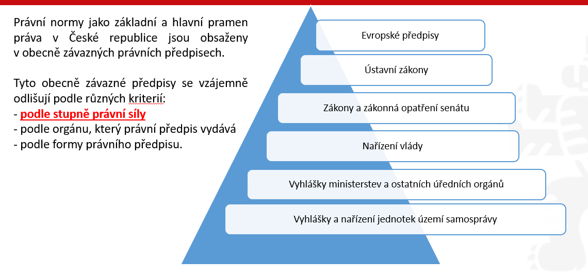

# Základy právních nauk

**Datum:** 13/09/25
**Témata:** Právo, pojem práva, dualismus, prameny práva a právní systémy, právní řád ČR, právní norma. Úvod do základů právních nauk.

---

<pre> 

.
└── ZAKLADY_PRAVNICH_NAUK_P01/
    ├── 01_UVOD_A_HISTORIE_PRAVA/
    │   ├── Širší (morálka, zvyky) vs. užší (zákony) význam
    │   └── Historické kořeny (Chammurapi, Římské právo, přechod k psanému právu)
    │
    ├── 02_PRAVNI_SYSTEMY_SVETA/
    │   ├── Kontinentální evropské právo (psané, zákony, aplikace norem)
    │   ├── Angloamerické právo (soudní precedenty, dotváření práva)
    │   └── Islámské a tradiční systémy (náboženská pravidla, obyčeje)
    │
    ├── 03_DUALISMUS_PRAVA_STAVEBNI_KAMENY/
    │   ├── Přirozené vs. pozitivní (platné) právo
    │   ├── Objektivní (právní řád) vs. subjektivní (konkrétní oprávnění)
    │   ├── Hmotné (co smím/nesmím - zákoníky) vs. procesní (jak to řešit - řády)
    │   ├── Soukromé (rovnost, autonomie) vs. veřejné (nadřízenost státu)
    │   └── Relativní (inter partes) vs. absolutní (erga omnes)
    │
    ├── 04_PRAMENY_PRAVA_A_PRAVNI_RAD_CR/
    │   ├── Normativní právní akty (původní vs. odvozené)
    │   ├── Normativní smlouvy (kolektivní, mezinárodní)
    │   ├── Nálezy Ústavního soudu
    │   ├── Právní obyčeje a soudní precedenty
    │   └── Mezinárodní právo a Právo EU (primární, sekundární)
    │
    ├── 05_PRAVNI_NORMA/
    │   ├── Znaky (všeobecná závaznost, normativnost, vynutitelnost)
    │   ├── Struktura (Hypotéza, Dispozice, Sankce)
    │   └── Členění (Kogentní vs. Dispozitivní; přikazující, zakazující, opravňující, deklaratorní)
    │
    ├── 06_PUSOBNOST_A_PUBLIKACE/
    │   ├── Působnost (místní/prostorová, osobní, věcná, časová - platnost a účinnost)
    │   └── Publikace (Sbírka zákonů, Sbírka mezinárodních smluv)
    │
    └── 07_APLIKACE_A_ANALOGIE/
        ├── Postup aplikace (stanovit problém -> vymezit úpravu -> aplikovat normu)
        └── Analogie (podle zákona, podle práva)
</pre>
# Klíčové otázky
## 1. Kde se právo vzalo a co to vůbec je?
**Příběh vývoje:** 

Lidé spolu nejdřív žili jen tak – platila morálka, etika a zvyky (to je to širší pojetí). Když se ale lidé začali hádat, tak morálka nestačila, protože každý si ji vykládal jinak. Proto společnost vybrala to nejdůležitější a dala tomu pevná, psaná pravidla, která všichni musí dodržovat – a stát je hlídá a trestá (to je to úzké pojetí, tedy právo).   

**Klíčová myšlenka** pro rozhovor: „Právo je zkrátka formalizovaná morálka, kterou stát zaručuje a v případě nutnosti vynutí silou.“

## Právo a jeho význam ve společnosti

**Širší význam** - (společnost, morálka, etika)

**Užší význam** - právo, zákony (opora právních předpisů)

co se osvěčilo ze širšího přešlo do užšího

## 2. Jak právo funguje v praxi? (Stavební kameny)

**Objektivní vs. subjektivní právo:**

Objektivni právo je celý ten balík zákonů (právní řád), který někde leží.   Subjektivní právo (pro každého jiná) je to, co z toho balíku patří tobě – tvoje osobní oprávnění (např. „mám právo reklamovat boty“).   

**Hmotné vs. procesní právo:**

Hmotné říká, co můžeš a co nesmíš (pravidla chování, např. v občanském zákoníku). Procesní říká, jakým postupem se toho domůžeš (jak probíhá soud, úřední řízení). Nastává když je hmotné porušeno.  

**Soukromé vs. veřejné právo:**

V soukromém právu jsme si všichni rovni (já a soused, kupní smlouva, stát jako právnická osoba). Ve veřejném právu je stát nahoře a ty dole – stát ti diktuje podmínky a ty musíš poslechnout (policie, pokuta, daně).  

obžaloba je trestní

žaloba je občanský

## 3. Jak se píše a čte zákon? (Právní norma)
Každá právní norma (každé pravidlo) má svou vnitřní kostru – trichotomickou strukturu:   

1. Hypotéza (Kdy?): Podmínka nebo okruh lidí, na které se to vztahuje (např. „Když je člověku 18 let...“).

2. Dispozice (Co má dělat?): Samotné pravidlo chování (příkaz, zákaz, dovolení) (např. „...může volit ve volbách“).   

3. Sankce (Co se stane, když to porušíš?): Trest nebo nepříznivý následek (pokuta, náhrada škody).

* A k tomu časová rovina: Zákon musí nejdřív projít platností (vyjde ve Sbírce zákonů, už existuje) a pak nastane účinnost (odkdy se jím opravdu musíš řídit).

Zkus si to představit na úplně obyčejné situaci, třeba na krádeži v obchodě:Morálka: Krást se nemá (to je širší rovina).   Hmotné právo (trestní zákoník): Říká, že krádež je trestný čin (hmotná norma).Procesní právo: Popisuje, jak tě policie zatkne a jak proběhne soud (procesní norma).Veřejné právo: Stát (policie/soudce) vystupuje z pozice moci proti tobě.

## 1. Historické kořeny práva

**Starověké právo**

***Chammurapiho zákoník:***

Byla to jedna z vůbec nejstarších písemných právních památek (starověká Babylonie, (1800–1700 př. n. l.)
). Fungoval na slavném principu „oko za oko, zub za zub“ a silně v něm
prospívalo náboženské uspořádání – společnost tehdy věřila, že právo a spravedlnost sesílají bohové.   

**Římské právo (Zákon XII desek):**

Základ moderních právních systémů

Jak správně říkáš, bylo neuvěřitelně nadčasové. Římané se odtrhli od čistého náboženského diktátu a začali právo stavět na logice, racionálních principech a ochraně majetku či smluv. Zákon XII desek byla vůbec první významná písemná kodifikace římského práva vyrytá na dvanácti dřevěných deskách, aby ji každý viděl na fóru. Na Římského práva staví dnešní kontinentální právní systém (včetně našeho).

**Rozdělení na soukromé a veřejné právo:**

Právě staří Římané přišli s tímto klíčovým rozdělením, které používáme dodnes – tedy rozdílem mezi tím, co řeší vztahy lidí mezi sebou (soukromé), a tím, co se týká státu a moci (veřejné).

**Jak se ze zvykového práva stalo právo psané?**

Vysvětlení: Jak už jsme nakousli dřív, zpočátku si lidé vystačili s ústními tradicemi a zvyky ("dělá se to takhle, protože to tak dělali naši předci"). S tím, jak se státy zvětšovaly a lidé z různých koutů spolu začali víc obchodovat, ale zvyky nestačily – každý kout mohl mít jiné. Proto stát musel pravidla sepsat, vydat je oficiálně na papíře (nebo deskách) a nastavit pro všechny stejný metr.

**Státy a právo: cesta od chaosu k řádu**

Vysvětlení: To je shrnutí celé té myšlenky. Kde není jasné právo a pravidla, tam vládne vůle silnějšího a chaos. Vznik státu a práva šly ruku v ruce – stát potřebuje nástroj (právo), kterým drží společnost pohromadě, řeší spory a zajišťuje, že lidé mohou bezpečně fungovat.

**Právo nejvíce rozkvetlo ve starověkém Římě, kde se rozlišovalo mezi civilním právem (ius civilis) a církevním právem (ius canonicum)**

Jak to chápat: Římané posunuli právo na úplně novou úroveň, přičemž dělili pravidla na občanská (světská) a církevní.   

**Římské právo také rozlišovalo mezi soukromým (ius privatum) a veřejným právem (ius publicum)**

Jak to chápat: Toto základní rozdělení na vztahy mezi rovnými lidmi (soukromé) a vztahy, kde vystupuje stát z pozice moci (veřejné), používáme v právu dodnes.

## 2. Právní systém

**Základní rozdělení:**

Většina států na světě staví své právo na jednom ze tří hlavních typů právní kultury, případně na jejich kombinaci.

**Tři hlavní pilíře světa:**

1. **Kontinentální evropské právo** (psané zákony, kodexy – to, co máme v ČR).   
   * **Základ:** Stojí na recepci (převzetí) starověkého římského práva.   
   * **Pramen:** Hlavním pramenem je psaný právní předpis (zákon, kodex).   
   * **Role soudu:** Soudci u nás právo netvoří – jejich úkolem je existující právní normy pouze aplikovat (použít na konkrétní případ). 

2. **Angloamerické právo** (soudní precedenty, zvyklosti v USA nebo Velké Británii). 

  * **Základ:** Stojí na „nalézání práva“ soudy (typicky Velká Británie, USA).   
  * **Pramen:** Hlavním pramenem je soudní precedent (rozhodnutí soudu v dosud neupraveném případu, které je závazné pro budoucí podobné soudy).   
  * **Role soudu:** Soudci právo neustále dotvářejí a jejich verdikty tvoří závazná pravidla pro budoucnost.  

3. **Islámské právo** (šaría, náboženské základy na Blízkém východě). 

  * Je to neměnné boží právo platící v některých státech Blízkého a Středního východu a v Africe.   

  * Primárně upravuje osobní věci jako rodinné, dědické nebo darovací právo. Závazkové právo (obchodní vztahy) se v těchto zemích často řídí převzatým kontinentálním nebo angloamerickým právem. 

4. **Systém tradičních a náboženských práv:**

  * Stojí na právních obyčejích a náboženských pravidlech.   
  
  * Často existuje paralelně vedle systémů, které v zemích (např. v Africe či Asii) zanechaly bývalé koloniální mocnosti. Dnes se uplatňuje hlavně v otázkách osobního statutu (např. v Indii, Izraeli nebo některých arabských zemích).

## 3. Dualismus práva – jeho různé podoby

### 3.1 Přirozené vs. pozitivní (platné) právo:

  * **Přirozené právo:** 
    
    Soubor nezadatelných principů a lidských práv, která člověk má už od narození jen proto, že je člověk (např. právo na život, na svobodu), nezávisle na tom, co píší zákony.

   * **Pozitivní (platné) právo:** 
   
    Konkrétní soubor norem a zákonů, které vydal stát a které jsou státem oficiálně vynucovány.

### 3.2 Objektivní vs. subjektivní právo:

  * **Objektivní právo:** 
  
    Celý právní řád, tedy všechen ten balík platných zákonů v daném státě.

    **Definice**

    `Souhrn nebo systém platných právních norem, jejichž plnění je vynutitelné státní mocí. Je totožné s právním řádem konkrétního státu.`

    `Právní řád konkrétního státu = souhrn všech právních norem, které jsou v daném časovém období na území konkrétního státu platné (objektivní právo)` 

  * **Subjektivní právo:** 
    
    Tvoje konkrétní osobní oprávnění, které pro tebe z toho objektivního práva vyplývá (např. „mám právo reklamovat zboží“, „mám právo volit“).

    **Definice**

    `Oprávnění jednotlivce vyplývající z právní normy (objektivního práva). Subjektivní právo je jinak řečeno zákonem garantovaná míra možného chování subjektu, adresáta právní normy (člověk, právnická osoba – obchodní společnost)`

    `Subjektivní právo je to, co adresát právní normy (objektivního práva) může učinit (jak může jednat), neboť mu to objektivní právo dovoluje`
       
### 3.3 Hmotné vs. procesní právo:
  * **Hmotné právo:** 
  
    Pravidla chování, která říkají, co smíš a nesmíš a jaká máš práva a povinnosti (např. občanský zákoník, trestní zákoník).

    Upravuje společenské vztahy po stránce věcné

  * **Procesní právo:** Pravidla postupu, která říkají, jak se svých práv domoci před úřady či soudy (např. občanský soudní řád, trestní řád). Nastává když je hmotné porušeno.

    Stanovuje postupy v různých typech řízení před státními orgány  

### 3.4 Soukromé vs. veřejné právo:
  * **Soukromé právo:** 
  
    Vztahy mezi rovnocennými subjekty (občany, firmami, ale i stát ale nemá dominantní pozici, fyzické a právní), kde platí smluvní volnost.(nikdo není nadřízení tomu druhému)

  * **Základní pravidlo chování:** 
  
    Platí zde zásada autonomie: „Občan může jednat tak, jak mu zákon nezakazuje, a není povinen činit to, co mu zákon neukládá.“
  
  * **Veřejné právo:** 
  
    Vztahy, kde je stát v nadřízené (svrchované) pozici vůči občanovi (daně, pokuty, trestní právo). 

    * Oblast veřejných zájmů, které stát reprezentuje, je v demokratické společnosti přesně vymezena.

    * Státní orgány jsou vázány zákonem a mohou jednat pouze v jeho mezích.

    * **Vázanost zákonem:** Zatímco občan v soukromém právu může dělat vše, co mu zákon nezakazuje, státní orgány jsou naopak vázány zákonem a mohou jednat pouze v jeho mezích
  
  

  
### 3.5 Relativní vs. absolutní právo:
  * **Relativní právo:** 
  
    Vztah působící „mezi stranami“ (inter partes) – např. závazek z konkrétní smlouvy platí jen mezi tebou a tím, s uzavřel smlouvu.   

    `Subjektivní právo účastníka právního vztahu, kterému odpovídá konkrétní povinnost jiného nebo více individuálně určených účastníků.`

  * **Absolutní právo:** 
  
    Vztah působící „vůči všem“ (erga omnes) – např. mé vlastnické právo k autu znamená, že všichni ostatní lidé na světě mají povinnost mi do něj nezasahovat a nerušit mě. 

    `Odpovídá mu povinnost neurčeného počtu subjektů nerušit oprávněného ve výkonu jeho práv.`

## 4. Prameny práva, právní normy, právní řád
* **Co je pramenem práva:** 

  Je to forma objektivního práva, která v sobě obsahuje právní normy. Tyto formy se liší podle toho, v jakém právním systému a kultuře se nacházíme.   

  Každý stát má svou vlastní a unikátní kombinaci pramenů práva.   

**4 hlavní historicky zformované typy pramenů práva:**

1. **Normativní právní akty** (např. zákony, nařízení) – to je to naše hlavní psané právo.   

2. **Soudní rozhodnutí, precedenty** – rozhodnutí soudů, která vytvářejí závazná pravidla pro budoucí případy (typické pro angloamerický systém).   

3. **Právní obyčeje** – historicky vůbec nejstarší pramen práva založený na dlouhodobých tradicích.   

4. **Normativní smlouvy** – mezinárodní nebo kolektivní smlouvy, které regulují určitou skupinu případů.

## Normativní právní akty

* **Co to je:** Jde o obecně závazné právní předpisy, tedy soubory právních norem vydané orgánem veřejné moci v náležité formě.

  * **Hlavní vlastnosti:** 

    * Jsou typickým pramenem pro kontinentální evropský právní systém. 

    * Vznikají právotvornou činností státních orgánů, které mají pravomoc právní normy vydávat, měnit nebo rušit. 

    * Aby byl normativní právní akt platný, musí být předepsaným způsobem oficiálně vyhlášen.

  * **Absolutně závazné prameny v ČR:** Do této hlavní kategorie patří společně s normativními smlouvami (včetně mezinárodních) a nálezy Ústavního soudu. 

**Původní (primární) normativní právní akty**

* **Nejvyšší právní síla:** Primární předpisy stojí na vrcholu právního systému.

* **Čtyři hlavní typy původních aktů:**
  1. **Ústava a ústavní zákony:** Jde o úplně nejvyšší zákony státu, které přijímá parlament ČR oběma komorami.

  2. **Zákony:** Standardní primární předpisy, které přijímá Poslanecká sněmovna (určité schvalovací funkce má i Senát a prezident republiky).

  3. **Zákonná opatření Senátu:** Vydává je Senát v situaci, kdy Poslanecká sněmovna nemůže vykonávat své pravomoci.

  4. **Obecně závazné vyhlášky:** Vydávají je obecní a městská zastupitelstva nebo kraje pro své území.

**Odvozené (sekundární) normativní právní akty**

* **Kdo je vydává:** Jde o akty výkonných orgánů a orgánů státní správy.

* **Právní síla:** Mají nižší právní sílu než zákony

* **Zásada podřízenosti:** Nesmí v žádném případě odporovat normativním právním aktům, od nichž jsou odvozeny.

* **K čemu slouží:** Slouží k podrobnější právní úpravě věcí, které už jsou v zásadě upraveny primárními normativními akty (zákony).

**Příklady odvozených právních aktů**

* **Vládní nařízení:** Vláda ČR je Ústavou generálně zmocněna k tomu, aby vydávala prováděcí nařízení k zákonům

* **Vyhlášky ministerstev a ústředních orgánů státní správy:** Tyto předpisy lze vydávat výhradně na základě výslovného zmocnění v konkrétním zákoně.

* **Vyhlášky a předpisy ČNB:** Vydává je Česká národní banka rovněž na základě zákonného zmocnění.

* **Nařízení obcí a krajů:** Jedná se o normativní právní akty vydávané v tzv. přenesené působnosti.

**Znaky normativních právních aktů**

* **Forma:** Normativní právní akt je výsledkem záměrné činnosti orgánu veřejné moci, který k tomu má legislativní pravomoc. Vzniká předepsanou legislativní procedurou a musí být řádně publikován, jinak se nemůže stát platným a účinným.

* **Normativita:** Znamená to, že daný předpis obsahuje obecná pravidla chování.

* **Abstraktnost:** Pravidla mají obecný charakter. Nejsou napsaná pro konkrétního člověka jménem, ale dopadají na každého, kdo se ocitne v typově určené situaci.

* **Obecná závaznost:** Předpis zavazuje všechny osoby, které se nacházejí v působnosti orgánu, jenž daný normativní právní akt vydal.

**Normativní smlouvy**

* **Co je smlouva:** Jedná se o dvoustranné či vícestranné právní jednání.

* **Kdy se stává pramenem práva:** Smlouva získá tzv. normativní význam a stane se pramenem práva teprve v okamžiku, kdy reguluje určitou skupinu případů stejného druhu.

* **Dva hlavní typy normativních smluv jako pramenů práva v ČR:**

  * 1. **Kolektivní smlouvy** uzavřené mezi zaměstnavateli a odbory na vnitrostátní úrovni.

  * 2. **Mezinárodní smlouvy**, pokud jsou řádně "převzaty" do našeho vnitrostátního práva.

## Nálezy Ústavního soudu

* **Ochránce ústavnosti:** Ústavní soud ČR je nejvyšším orgánem, který má roli "ochránce ústavnosti".

* **Dotváření práva:** Formou svých nálezů dotváří již existující formální soustavu pramenů práva v ČR (tedy normativní právní akty a normativní smlouvy).

* **Zrušení zákona:** Pokud Ústavní soud v řízení zjistí, že nějaký zákon nebo jeho část je v rozporu s ústavním zákonem, rozhodne nálezem a takový předpis (nebo jeho ustanovení) ke dni stanovenému v nálezu zruší.

## Prameny práva (angloamerický systém) 

### Právní obyčej

* **Historický původ:** Patří k historicky nejstarším pramenům práva, v České republice se však uplatňuje pouze výjimečně (například v podobě obchodních zvyklostí).

* **Zvykové právo:** Jde o systém založený na právních obyčejích, které se v určitém společenství dlouhodobě ustálily a jsou všeobecně uznávány a dodržovány.

* **Podmínka pro uznání za pramen práva:** Aby byl obyčej brán jako pramen práva, musí ho stát oficiálně uznat, státní orgány ho musí aplikovat na konkrétní případy a v případě jeho porušení musí následovat státní sankce.

### Soudní precedent

* **Co to je:** Jde o rozhodnutí soudu nebo jiného státního orgánu, kterým se řeší situace, jež nebyla právem dosud regulována – tedy se jedná o vůbec první řešení daného případu, který dosud nebyl právem upraven.   

* **Právní závaznost pro budoucnost:** Podstatou precedentu je skutečnost, že toto vůbec první posouzení případu se do budoucna stává právně závazným pro všechny další případy stejného druhu.   

* **Kde se vyskytuje:** Tento pramen práva je nejcharakterističtější pro angloamerický systém nebo mezinárodní právo. 

## 5. Právní normy

* **Základní jednotka:** Právní norma je základní a nejmenší jednotkou právního normativního aktu.

* **Pravidlo chování:** Jde o závazné pravidlo chování, které se vyznačuje třemi klíčovými znaky:

  * 1. **Všeobecnou závazností:** Platí pro všechny subjekty, na které dopadá.

  * 2. **Normativností:** Chování je v ní nastaveno v podobě obecného a abstraktního pravidla (neřeší konkrétní jeden případ jmenovitě).

  * 3. **Vynutitelností státní mocí:** Pokud někdo normu poruší, stát je schopen a oprávněn vynutit nápravu nebo uložit sankci.

## Kogentní a dispozitivní právní normy
* **Kogentní právní norma:**

    * Je to taková právní norma, u níž není možné se odchýlit.

    * Strany si nemohou sjednat nic jiného, než co norma přikazuje.

    * Je typická zejména pro právo veřejné.

    * Zahrnuje obecný příkaz, zákaz nebo dovolení a dělí se na přikazující, zakazující a opravňující.

* **Dispozitivní právní norma:**

    * Je to taková právní norma, u které se lze odchýlit od pravidla chování obsaženého v dispozici normy.

    * Pokud si strany víceméně sjednají pravidla po svém, má přednost jejich ujednání; pravidlo ze zákona nastupuje až tehdy, kdy si strany vlastní postup nezvolí.

    * Je typická pro právo soukromé (např. v občanském právu a smluvních vztazích).

## Struktura právní normy

* **Hypotéza:**

    * Vyjadřuje podmínky, za kterých se má realizovat vlastní pravidlo chování.

    * Vymezuje okruh adresátů normy, čas a působnost.

* **Dispozice:**

    * Upravuje vlastní pravidlo chování.

    * Subjektům něco přikazuje, zakazuje nebo je opravňuje k nějakému jednání.

    * Nastupuje za předpokladu, že nastaly okolnosti stanovené v hypotéze.

* **Sankce:**

    * Je předem stanovený následek za to, že nebyla dodržena dispozice právní normy.

    * Nemusí představovat pouze trest, ale může jí být například povinnost nahradit škodu.

    * Může plnit několik funkcí, mezi které patří preventivní, nahrazovací a represivní.

## Příklad struktury právní normy

* **Rozptýlení v právním řádu:** V reálném právním řádu najdeme všechny tři části v jediném ustanovení pouze výjimečně, velmi často bývají rozptýleny v rámci určitého právního předpisu.

* **Příklad hypotézy:** „kdo najde ztracenou věc“ – vymezuje podmínku a situaci, na kterou se norma vztahuje (§ 135 OZ).

* **Příklad dispozice:** „je povinen ji vydat vlastníkovi“ – stanoví pravidlo chování pro danou situaci (§ 135 OZ).

* **Příklady sankce:** Náhrada újmy, úroky z prodlení (v případě prodlení s plněním dluhu a podobně).

### Další členění právních norem:

- **Přikazující:** ukládají povinnost chovat se určitým způsobem. (Např. povinnost užívat ochrannou přílbu).
- **Zakazující:** stanovují povinnost zdržet se určitého chování. (Např. osoba nesmí vyhazovat předměty z vozidla).
- **Opravňující:** formulují určité oprávnění, možnost se chovat určitým způsobem, aniž by to bylo povinné. (Např. právo na ochranu osobnosti).
- **Deklaratorní:** vyjadřují principy či deklarují politické, sociálně ekonomické nebo etické cíle.

---

## 6. Působnost právních norem

Při používání právních předpisů je třeba vždy vyhodnotit:

- Územní obvod, na kterém norma působí.
- Okruh vztahů, na které se norma vztahuje.
- Okruh subjektů, kterých se norma týká.
- Platnost a účinnost právního předpisu.

**Typy působnosti:**

- **Místní (prostorová):** vymezuje území, na kterém předpis platí. Rozlišujeme: a) celostátní (zákony), b) omezenou (vyhlášky obce).
- **Osobní** Na koho se vztahuje.
- **Věcná** Jakých konkrétních případů se norma týká.
- **Časová (Platnost x účinnost)**(Platnost vs. Účinnost):** *Platnost* = vyšlo ve Sbírce, už to existuje. *Účinnost* = odkdy se tím musím reálně řídit.

---

## Právní řád České republiky

- **Souhrn všech platných a účinných pramenů práva na území daného státu.**
- Je tvořen všemi právními předpisy ČR a v nich obsaženými právními normami.
- Nejdůležitějšími právními předpisy jsou zákony (soubory pravidel chování upravující základní oblasti života).
- Právní normy jako základní a hlavní pramen práva v ČR jsou obsaženy v obecně závazných právních předpisech.

**Obecně závazné předpisy se vzájemně odlišují podle:**

- Stupně právní síly.
- Orgánu, který právní předpis vydává.
- Formy právního předpisu.

---

## Mezinárodní právo a Právo EU v ČR

- **Mezinárodní právo veřejné:** reguluje mezinárodní vztahy mezi veřejnými subjekty (státy a mezinárodní organizace).
- **Mezinárodní právo soukromé:** reguluje mezinárodní vztahy mezi soukromými osobami.
- **Právo EU:** Evropská unie má rámcová pravidla pro jednotlivé typy společenských vztahů. Povinností všech členských států je sladit svůj právní řád s normami EU. Důvodem je průchodnost vztahů mezi subjekty za relativně stejných právních podmínek (Primární a sekundární právo).

---

## Publikace pramenů práva

Dva publikační způsoby v České republice:

1. **Sbírka zákonů (Sb.)**
   - Publikují se zákony, nálezy Ústavního soudu, rozsudky Nejvyššího správního soudu, sdělení Ústavního soudu atd.
   - Podmínkou platnosti a účinnosti převážné většiny obecně závazných právních předpisů (s výjimkou předpisů územní samosprávy) je jejich publikování ve Sbírce zákonů.

2. **Sbírka mezinárodních smluv (Sb.m.s.)**
   - Vyhlašují se sdělením Ministerstva zahraničních věcí: platné mezinárodní smlouvy, oznámení a výpovědi mezinárodních smluv, rozhodnutí přijatá mezinárodními orgány, jimiž je ČR vázána.

## 7. Aplikace a interpretace právních norem

**Postup:**

1. Stanovit problém.
2. Vymezit právní úpravu.
3. Aplikovat právní normu a stanovit řešení.

**Analogie v právu:**

- **Analogie podle zákona:** použití norem, které řeší obdobné otázky.
- **Analogie podle práva:** pokud nejsou ani obdobné právní normy, situace se řeší podle obecných právních zásad.

# Moje zápisky
Aplikace prává:

    1) Kontinentální - co je psáno je dáno, právní předpisy z nich vycházíme, řídí zákonem

    2) Anglosaský - anglie, irsko, rozhoduje poroto, jedou podle soudních precendentů (vydáváho soud, a pak se může tím precedentem řídít)

    3) islamský - dovolává se boha

Právo decenralizuje na dva soubory:

Veřené a soukromé právo

Veřejné - na jedné straně je stát dominantní pozici, finanční, trestní a správní. Stát x fyzické a právní

Soukormé právo - Stát x fyz. a prav. os, fyz x fyz, fyz x prav, prav x prav, stát není v dominantní pozice

se dělí na: Občasnký, Obchodní, Pracovní

Každé zákon má svojí právní normu(hmotnou formu)

každé odvětní - právní normu tedy zákon (hmotnou - zákon, procesní(končí řád) )

správní řád

trestní řád - proces oznámím polici, chití při činu,

daňový řád

Zákon o zválštním řízení soudu v něm obsahují (občanské, obchodní, pracovní)

Občanský soudní řád ()

občanský zákoník

