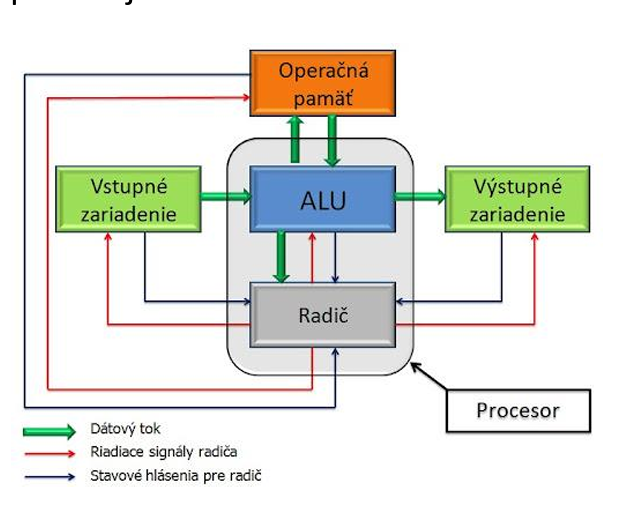
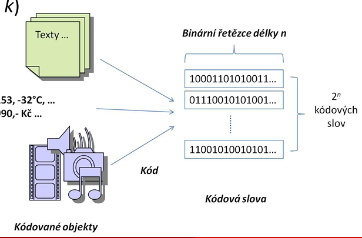

# Úvod do principu počítačů
## Informace a data v počítači

**David Buchtela**  
přednáška 02  
Provozně ekonomická fakulta, Katedra informačního inženýrství  
Buchtela@pef.czu.cz  
(P02) B-UPP

---

## Informace versus data

*   **Data** (jednotné číslo *údaj*) obvykle chápeme jako údaje, tj. číselné hodnoty, znaky, texty a další fakta zaznamenaná ve formě uspořádané posloupnosti znaků zvolené abecedy - obvykle binární řetězce.
    *   jakékoli vyjádření (reprezentaci) skutečnosti, schopné přenosu, uchování, interpretace či zpracování
*   **Informace** - sdělení, komunikovatelný poznatek, který má význam pro příjemce nebo údaj usnadňující volbu mezi alternativními možnostmi při rozhodování příjemce
*   Procesu, při kterém z dat získáváme zpětně informace, říkáme **interpretace dat**
*   Data sama o sobě tedy ještě neznamenají informaci. Informaci z dat získáme pouze tak, že porozumíme, co nám sdělují, tedy umíme je interpretovat.
    *   např. text napsaný v čínštině nebo Morseova abeceda /---/ (S.O.S.)
*   **Počítač** (výpočetní systém) = stroj na automatické ukládání, zpracovávání, zpřístupňování a přenos dat

* Rozdíl mezi Data a Informace, data je ten řetězec 01010 informace je ta interpretace je to (číslo, znaky, atd.)

---

## Data v počítači

Počítač von Neumannovy architektury používá dvojkovou soustavu, tj. všechny součásti počítače zpracovávají údaje v podobě nul a jedniček.

*   **Operační paměť** ukládá data i programy v podobě nul a jedniček
*   **Aritmeticko-logická jednotka (ALU)** počítá ve dvojkové soustavě
*   **Vstupní zařízení** převádějí vstupní údaje (např. stisk klávesy) na nuly a jedničky
*   **Výstupní zařízení** převádějí nuly a jedničky na výstupní údaje (např. na barvu na obrazovce)

**Reprezentace (kódování) dat (čísel, textů, barev apod.) v počítači**
*   popisujeme, jak jsou data (čísla, texty, barvy apod.) uložena v počítači, tedy jak jsou vyjádřena v nulách a jedničkách

---

## Kódování (reprezentace) dat v počítači

Chceme-li uložit a dále zpracovávat jakákoliv data v počítači, je potřeba je vhodným způsobem zakódovat do binární soustavy.
*   najít pro každý typ dat vhodný kód K

**Kód** je prosté (vzájemně jednoznačné) zobrazení množiny kódovaných objektů $X$ do množiny kódových slov $X'$

*   {objekty} $\rightarrow$ {kódová slova}
*   Je nutno najít způsob kódování informačních dat (kódem k)
*   Zobrazení množiny objektů $\{x_i\}$ na množinu kódových slov $\{x'_i | x'_i = k(x_i)\}$, kde kódovými slovy jsou binární řetězce
*   mají-li binární kódová slova délku $n$ lze vytvořit $2^n$ různých kódových slov

---

## Dekódování (interpretace) dat

Při zpětné interpretaci uložených dat (zjištění, co kódové slovo představuje) je třeba znát kód, kterým byl kódovaný objekt do tohoto kódového slova zakódován.
Stejné kódové slovo ($n$-bitový binární řetězec) tak může, při použití různých kódů, představovat různé objekty (číselnou hodnotu, znak, ...).

---

## Binární kódy

### Binární kód

kód je prosté (vzájemně jednoznačné) zobrazení množiny kódovaných objektů $x_i$ do množiny kódových slov $x'_j$
množ. objektů $\{x_i\} \rightarrow$ množ. kódových slov $\{x' | x'_i = k(x_i)\}$
*   kde kódovými slovy jsou binární řetězce
*   mají-li binární kódová slova délku $n$ lze vytvořit $2^n$ různých kódových slov
*   např. $n=8$ (1 byte) $\rightarrow 2^8 = 256$ různých kódových slov

| Délka kódového slova | Počet bitů (n) | Počet různých kódových slov |
| :--- | :--- | :--- |
| 1 bit | 1 | $2^1 = 2$ |
| 1 půlbyte | 4 | $2^4 = 16$ |
| 1 byte | 8 | $2^8 = 256$ |
| 2 byte | 16 | $2^{16} = 65 536$ |
| 3 byte | 24 | $2^{24} = 16 777 216$ |
| 4 byte | 32 | $2^{32} = 4 294 967 296$ |
| ... | n | $2^n$ |

---

## Hammingova vzdálenost

Binární kódová slova délky $n$ lze chápat jako body v $n$-rozměrném Eukleidovského prostoru $E^n$ tvořící vrcholy jednotkového objektu v tomto prostoru.

**Hammingova vzdálenost**
$$d(X,Y) = \Sigma_{i=1}^{n}|x_i - y_i|$$
kde $X=(x_1,x_2,...x_n)$ a $Y=(y_1,y_2,...y_n)$
*   vzdálenost bodů v prostoru, tj. nejmenší počet hran, na cestě, která spojuje body X a Y
*   počet bitů (souřadnic), ve kterých se X a Y od sebe liší, pokud jsou kódová slova binární řetězce

**Minimální kódová vzdálenost (Hammingova váha kódu)**
$$d_{min} = min_{X_{i,j} \in K} d(X_i,X_j)_{i \ne j}$$
pro všechny dvojice různých kódových slov $X_i$ a $X_j$ z kódu K

---

## Rozdělení binárních kódů dle $d_{min}$

Podle hodnoty minimální kódové vzdálenosti lze kódy rozdělit:
*   kód (splnění definice kódu)
    *   $d_{min} \ge 1$
*   zabezpečující kód
    *   $d_{min} \ge 2$
    *   lze detekovat obecně $d_{min}-1$ chyb
*   samoopravný kód
    *   $d_{min} \ge 3$
    *   lze opravit obecně $(d_{min}-1) \text{ div } 2$ chyb

* Představit si to jako X bod a mezi je bod který má v sobě chybu, pokud je chyba 2 tak. S těma hramnam

---

## Konstrukce zabezpečujícího kódu

Kódy, které mají $d_{min}=1$, tj. nejsou zabezpečující, se rozšiřují o tzv. **paritní bit**.
původní kód s kódovými slovy $X=(x_1,x_2,...x_n)$ rozšíříme o paritní bit na kód s kódovými slovy $x'=(x_1,x_2,...x_n, p)$

*   **lichá parita**
    *   výsledný počet jedniček v $X'$ je lichý
    *   $p = x_1 \oplus x_2 \oplus ... \oplus x_n \oplus 1$
*   **sudá parita**
    *   výsledný počet jedniček v $X'$ je sudý
    *   $p = x_1 \oplus x_2 \oplus ... \oplus x_n$

---

## Konstrukce samoopravného kódu

*   Vycházíme z binárního kódu délky $m$ bitů
    *   kódová slova jsou $m$-bitové binární řetězce
    *   bity řetězce se označují jako datové - $(d_1...d_m)$
    *   $d_{min} = 1$
*   Kód rozšíříme o $k$ paritních bitů
    *   vzniknou kódová slova délky $(m+k)$ bitů
    *   $(d_1...d_m, p_1...p_k)$
*   Hledáme samoopravný kód $d_{min} = 3$
*   Rovnice:
    *   $m+k+1 \le 2^k$
    *   $2^m + (m+k)\cdot 2^m \le 2^{(m+k)}$
    *   $k+m+1 \le 2^k$
    

---

## Hammingův kód

Hammingův kód – **SEC (Single Error Correcting)**
*   $d_{min} = 3$
*   uspořádání datových $(d_1...d_m)$ a paritních $(p_1...p_k)$ bitů
    *   všechny pozice, jejichž číslo je rovno mocnině 2 jsou použity pro paritní bity (tj. pozice 1, 2, 4, 8, 16, 32,...)
    *   ostatní pozice jsou postupně obsazeny datovými bity
    *   $p_1^{(2^0)}, p_2^{(2^1)}, d_1^3, p_3^{(2^2)}, d_2^5, d_3^6, d_4^7, p_4^{(2^3)}, d_5^9, d_6^{10}, d_7^{11}, d_8^{12}, d_9^{13}, d_{10}^{14}, d_{11}^{15}, p_5^{(2^4)}, d_{12}^{16}$
*   každý paritní bit je vypočítán z některých datových bitů
    *   pozice paritního bitu udává sekvenci bitů (kódového slova), které se pro výpočet použijí a které vynechají počínaje pozicí paritního bitu
    *   např. pro paritní bit $p_1$ (pozice 1) 1 bit se použije, 1 bit vynechá
        *   $p_1 = d_1 \oplus d_2 \oplus d_4 \oplus d_5 \oplus d_7 \oplus d_9 \oplus ...$
    *   pro paritní bit $p_2$ (pozice 2) 2 bity se použijí, 2 bity vynechají
        *   $p_2 = d_1 \oplus d_3 \oplus d_4 \oplus d_6 \oplus d_7 \oplus d_{10} \oplus ...$

---

## Princip zabezpečení dat SEC kódem

Korektor je schopen chybu v jednom bitu opravit na základě syndromů z komparátoru. Chyby ve dvou bitech ale opraví špatně.

**SEC DED (Double Error Detecting) kód**
*   SEC kód rozšířený o bit celkové parity (sudá / lichá) je schopen detekovat chybu ve dvou bitech.

---

## Kódování dat v počítači

### Data v počítači
*   **Informační data** (elementární datové typy)
    *   data, která po interpretaci mohou přinášet nějakou informaci
    *   Logické hodnoty
    *   Znaky
    *   Čísla
        *   v pevné řádové čárce (celá čísla)
        *   v pohyblivé (plovoucí) řád. čárce (reálná čísla)
*   **Povelová data** (instrukce programu)
    *   data, která určují počítači (procesoru), jakým způsobem zpracovávat informační data

Log. O -> 0 false
Log. 1 -> != 0 true

---

## Kódování logických hodnot v počítači

Logickou hodnota - rozhodnutí, zda je něco pravda či nepravda
*   možné teoreticky uložit do kódového slova délky 1 b (bit)
*   v praxi se ale logická hodnota obvykle ukládá do kódového slova velikosti 1 B (byte)

Logické hodnoty mohou být:
*   **nepravda** (logická 0)
    *   kódové slovo `0000 0000` - nulová hodnota
*   **pravda** (logická 1)
    *   kódové slovo např. `0000 0001` - (jakákoliv) nenulová hodnota

---

## Reprezentace textu (znaků)

### Texty
Každý text chápeme jako posloupnost znaků příslušné abecedy, tj. znakových hodnot.
Při ukládání textu ukládáme dvě skupiny informací:
*   informace o jednotlivých znacích textu, tzv. **prostý text**
*   informace o **formátování textu** (velikost a typ písma, barva, podtržení atd.)

Formátování textu ukládá skoro každý program jinak, proto se budeme zabývat jen uložením prostého textu.

### Znaky
Znak, znakovou hodnotu lze rozdělit na:
*   **řídicí** = znak má speciální význam pro řízení zpracování ostatních znakových hodnot, např. konec zprávy, nová řádka
    *   takové znaky představují tzv. netisknutelné znaky, tj. nemají žádnou viditelnou podobu (např. znak pro přesun na nový řádek - „Enter")
*   **grafický** = znak má význam grafického symbolu pro písmena, číslice, interpunkce, značky, ....
    *   Takovéto znaky představují tzv. vnější reprezentaci vhodnou pro zobrazení na monitoru či tisk na tiskárně

---

## Reprezentace prostého textu

Princip reprezentace prostého textu lze popsat následujícím postupem:
1. Text se rozdělí na jednotlivé znaky, které jsou pak uloženy jeden za druhým
2. Každý znak se pomocí speciální převodní tabulky (kódu) převede na číslo (desítkové) $\rightarrow$ kódové slovo
    * Kódování: $x = \text{znak}$, $x' = \text{číslo}$
3. Číslo znaku se uloží ve (převede do) dvojkové soustavě
    * Převod: $x'$ (desítkově) $\rightarrow$ binární číslo

**Příklad: Uložte text AHOJ**
*   text rozdělíme na znaky „A“, „H“, „O“ a „J“
*   $A'=65$, $H'=72$, $O'=79$ a $J'=74$
*   A' $\rightarrow$ 01000001, H' $\rightarrow$ 01001000, O' $\rightarrow$ 01001111, J' $\rightarrow$ 01001010

---

## Kódování znakových hodnot

Většina programů používá pro kódování znaků jednu ze tří metod:
1.  **7-bitový ASCII kód (1973)**
    *   ASCII - American Standard Code for Information Interchange
    *   pro znaky se používají 7-bitová kódová slova (128 znaků)
2.  **8-bitový ASCII kód - kódové stránky (80-90. léta)**
    *   pro znaky se používají 8-bitová kódová slova (256 znaků)
3.  **Unicode (1991)**
    *   pro znaky se používají kódová slova velikosti 1 až 4 bajty ($8-32 \text{ bitů}$) $\rightarrow$ cca 100 000 znaků

---

## 7-bitový ASCII

Tabulka ASCII obsahuje tyto znaky:
*   Písmena abecedy, malá i velká - bez diakritiky
*   Číslice 0 až 9
*   Větnou interpunkci (čárku, tečku, vykřičník, otazník, dvojtečku, závorky, ...)
*   Několik dalších, speciálních znaků (@, &, #, ...), mezeru (znak s číslem 32)
*   řídící znaky - znaky s čísly 0 až 31 a znak 127

---

## 8-bitový ASCII

Tabulka ASCII obsahuje navíc tyto znaky:
*   rozšíření o 128 znaků s interpunkcí není dostatečné pro všechny jazyky
*   více rozšíření, tzv. kódových stránek pro různé jazyky (skupiny jazyků)

### 8-bitový ASCII - kódové stránky
V dnešní době převažuje používání dvou skupin kódových stránek:
*   **Kódové stránky ISO 8859-1 až ISO 8859-16 (LATIN1 – LATIN16)** (např. v operačním systému Linux)
*   **Kódové stránky Windows 1250 až Windows 1258** (např. v operačním systému Windows)
    *   V programech firmy Microsoft se tyto kódové stránky často souhrnně označují zkratkou ANSI, přičemž záleží na jazykové verzi programu, která konkrétní kódová stránka je tím myšlena.

Jedna kódová stránka obvykle obsahuje znaky potřebné v jedné geografické nebo jazykové oblasti (např. kódová stránka ISO 8859-1 je určena pro západoevropské jazyky).
*   !!! V jednom textu nelze použít více kódových stránek !!!
*   kódové stránky ISO 8859-2 (LATIN2) a Windows 1250 pokrývají všechny znaky využívané v češtině
*   !!! Význam znaků není zcela jednoznačný ani pro stejné jazyky !!!

---

## Unicode

Tabulka Unicode obsahuje znaky všech světových jazyků. V současné době obsahuje přes 100 000 znaků. V textu není problém používat znaky z více jazyků.

Pro převod čísla znaku do dvojkové soustavy se používají různé metody, nejpoužívanější se označují jako **UTF-8, UTF-16 a UTF-32** (UTF = Unicode Transformation Format). Pokud je někde uvedeno pouze obecné „Unicode", znamená to často metodu UTF-16.

Volba metody UTF má vliv např. na velikost reprezentace znaku:
*   při použití UTF-8 má reprezentace znaku velikost 1, 2, 3 nebo 4 bajty (podle typu znaku)
*   při použití UTF-16 mají znaky 2 nebo 4 bajty
*   u UTF-32 mají všechny znaky 4 bajty

---

## Použití kódování textu

*   Nejrozšířenějším kódování webových stránek bylo do roku 2007 ASCII, pak ho vystřídal Unicode ve variantě UTF-8
*   Program Word pro uložení prostého textu používá Unicode
    *   u souborů *.doc používá variantu UTF-16
    *   u souborů *.docx (verze 2007 a novější) variantu UTF-8
*   Pro uložení názvu souboru používá operační systém Windows kódování Unicode UTF-16
*   Řada programů ale stále používá kódové stránky
    *   např. Poznámkový blok jako výchozí kódování textu použije ANSI (tj. kódovou stránku dle jazykové verze Windows)

---

## Srovnání kódování textu

| Znakový repertoár | ASCII | Kódová stránka | Unicode |
| :--- | :--- | :--- | :--- |
| a-z A-Z 0-9 | Angličtina | | |
| .,?!:() | | | |
| $+-*/=\%$ | | | |
| @ # $ ^ & \| | | | |
| mezera, konec řádku | | | |
| áéí óúů, ěščřžň | | jazyky z jedné oblasti | |
| ÁÉŮĚŇ | | | |
| å ő öş | | | |
| $\xi(\overline{C})\pm x$ | | | všechny současné jazyky |
| жидкость, 無機化合物, אלוהים, العربية | | | |