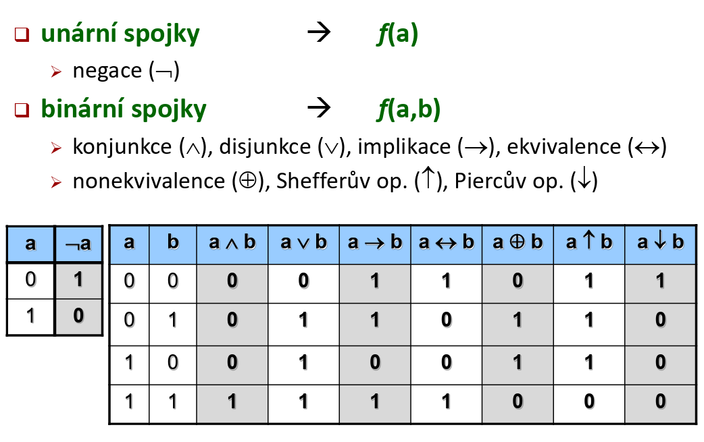
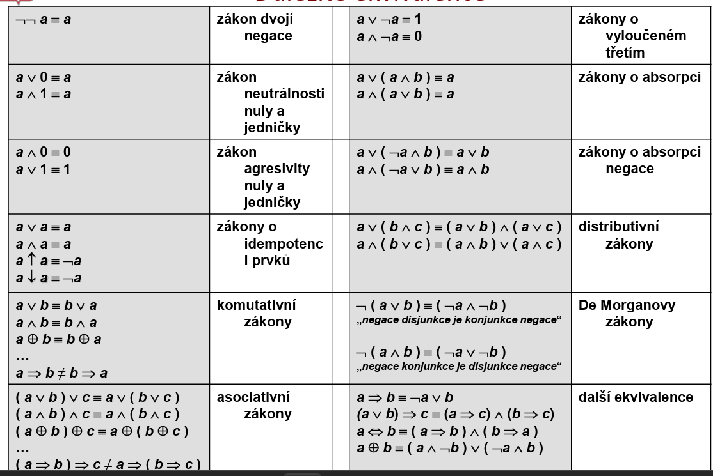
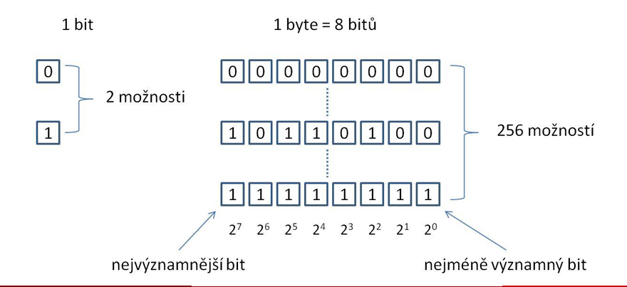
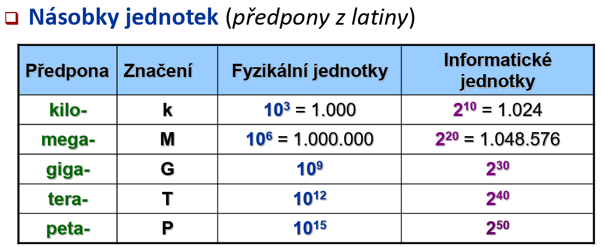

# Úvod do principu počítačů & Úvod do matematické logiky

**Přednáška 01 (P01) B-UPP**
**Přednášející:** Ing. David Buchtela, Ph.D.
Provozně ekonomická fakulta (Katedra informačního inženýrství)

## Kontakt

- **Místnost:** PEF 552 (5. patro)

- **Telefon:** +420 22434 3806

- **E-mail:** buchtela@pef.czu.cz

- **Konzultace:** středa 10:30 – 12:00 (jindy po dohodě)

## Cíl a náplň předmětu

Cílem předmětu je seznámit se podrobně s principem činnosti současných počítačů Von Neumannova typu.

- Hlavním zaměřením je programové vybavení počítače, strojový kód, algoritmizace a strukturovaný návrh programů.
- Dále seznámení se s hlavními statickými a dynamickými datovými strukturami.

**Témata přednášek:**

- **Základy logiky:** binární soustava v počítači, výrokový počet a logický důsledek.

- **Kódování dat v počítači:** binární kódy (zabezpečovací, samoopravný), kódování a interpretace dat, základní datové typy.

- **Architektura a princip počítače:** Von Neumannova architektura, strojový kód, logické instrukce.

- **Programové vybavení počítače:**
  - Operační systém - role a rozhraní OS, procesy a spolupráce procesů.

  - Aplikační software - principy strukturovaného návrhu algoritmů (programů).

- **Statické a dynamické datové struktury:** pole, záznam, objekt, ukazatel, spojový seznam, binární strom.

- **Technické vybavení počítače:** procesor, paměti, periferní zařízení...

## Doporučená literatura

- **Systém Moodle.czu.cz:** kurz Úvod do principů počítačů, klíč k zápisu odpovídá termínu cvičení.

- **Buchtela, D., Vynikarová, D.:** Cvičebnice z předmětu Výpočetní systémy, Praha: PEF ČZU, 2013.

- **Milková, E., Voborník, P.:** Algoritmy: objasnění, procvičení a vizualizace základních algoritmických konstrukcí, Praha: Alfa Nakladatelství, 2008.

- **Pondělíček, B., Demlová, M.:** Matematická logika, Praha: FEL ČVUT, 1997.

- **Vaníček, J., Papík, M., Pergl, R. a Vaníček, T.:** Teoretické základy informatiky, Praha, Kernberg Publishing, 2007.

## Zakončení předmětu a hodnocení

Předmět je zakončen zápočtem a zkouškou.

**Podmínky zápočtu:**

- Přiměřená účast na cvičeních (dle podmínek cvičícího).

- Absolvování všech (3) autotestů v systému Moodle ČZU.

- Praktické příklady z probírané problematiky (neomezený počet pokusů, je třeba získat plný počet bodů).

**Zkouška (podmínkou je získání zápočtu):**

- **Písemná část:**
  - Povinná pro všechny, trvání max. 45 minut.

  - Poměr teoretických a praktických otázek cca 1:1.

  - 2x malá teoretická otázka, 1x praktický příklad, 1x algoritmus.

  - Každá dílčí otázka je hodnocena známkou 1 až 4. Výsledná známka je "vážený" průměr (teoretické otázky mají větší váhu). 2x hodnocení 4 znamená celkovou 4.

- **Ústní část:**
  - Dobrovolná (při hodnocení 1, 2, 3), zbytečná (při hodnocení 4).

  - Může se týkat jakékoliv probírané oblasti. Hodnocení lze změnit o libovolný počet stupňů oběma směry.

  - Pokud se student nedostaví a neomluví v den zkoušky -> hodnocení 4!

## Úvod do matematické logiky

## Obsah

Úvod do matematické logiky

<pre>
├── Logika
│   ├── věda o správném usuzování
│   └── zkoumá, zda závěr vyplývá z předpokladů
│
├── Matematická (formální) logika
│   ├── neřeší pravdivost ve skutečnosti
│   ├── řeší správnost odvození závěrů
│   ├── matematické důkazy
│   ├── logické obvody
│   └── podmínky v programech
│
├── Výrokový počet
│   ├── Výrok
│   │   ├── Pravda (1)
│   │   └── Nepravda (0)
│   │
│   ├── Elementární výroky
│   │   └── a, b, c, x, y, z
│   │
│   ├── Složené výroky
│   │   └── spojení výroků pomocí spojek
│   │
│   ├── Logické spojky
│   │   ├── ¬  Negace
│   │   ├── ∧  Konjunkce (a)
│   │   ├── ∨  Disjunkce (nebo)
│   │   ├── ⇒  Implikace
│   │   ├── ⇔  Ekvivalence
│   │   ├── ⊕  XOR
│   │   ├── ↑  NAND
│   │   └── ↓  NOR
│   │
│   ├── Pravdivostní tabulky
│   │   └── výpočet hodnot formulí
│   │
│   ├── Tautologie
│   │   └── vždy pravdivá
│   │
│   ├── Kontradikce
│   │   └── vždy nepravdivá
│   │
│   ├── Ekvivalence formulí
│   │   ├── A ≡ B
│   │   └── A ⇔ B je tautologie
│   │
│   └── Logický důsledek
│       └── z předpokladů plyne závěr
│
└── Praktické využití v informatice
    ├── binární logika (0,1)
    ├── logické obvody
    ├── procesory
    ├── strojový kód
    └── podmínky v programech
</pre>

### Matematická logika

**Logika**

> pochází od řeckého slova **logos** (slovo, rozum, smysl).

$\rightarrow$ Logika je vědecká disciplína o správném uvažování (usuzování).

**Matematická (formální) logika**

> neřeší, zda předpoklady jsou pravdivé, ani zda výsledek je ve shodě se skutečností, ale **pouze zda závěr vyplývá z daných předpokladů**.

**Uplatnění matematické logiky:**

- Nutná k **přesnému matematickému vyjadřování**, k formulaci matematických vět a ke jejich konstrukci důkazů.

- **Při analýze a syntéze (konstrukci) elektronických logických obvodů** (základními prvky počítačů).

- **Při konstrukci rozhodovacích podmínek. při návrhu softwaru**

  strojový kód procesoru vyhodnocuje podmínky pomocí logických instrukcí.

### Výrokový počet

**Výrokový počet**

> studium závislosti pravdivostní hodnoty složeného výroku na způsobu spojení a na pravdivostních hodnotách jednotlivých výroků.

**Výrok:**

> každá oznamovací věta (sdělení), o které lze rozhodnout, zda je pravdivá či nepravdivá.

- _Výrokem je:_ Prší. Svítí sluníčko.

- _Výrokem není:_ Kéž by pršelo! Pro celé číslo x platí, že $x>3$.

- **Pravdivostní hodnoty:**
  - Pravda (true) – značíme 1 nebo $t$

  - Nepravda (false) – značíme 0 nebo $f$

### Výroky

- **Elementární výrok (logická proměnná):**

  > Základní výrok, jehož struktura se dále nedělí. Značíme malými písmeny: $a, b, c, ..., x, y, z$.

- **Složený výrok (logická formule):**

  > Spojení elementárních výroků pomocí závorek a logických spojek. Značíme velkými písmeny: $A, B, C...$.
  - X: Prší a nesvítí sluníčko.
  - Y: Jestliže svítí sluníčko, nevezmu si deštník

### Vybrané logické spojky

| Spojka             | Význam              | Značka            | Příklad                                                    |
| ------------------ | ------------------- | ----------------- | ---------------------------------------------------------- |
| negace             | „není pravda, že"   | $\neg$            | Není pravda, že prší.                                      |
| konjunkce          | „a (zároveň)"       | $\wedge$          | Prší a svítí sluníčko.                                     |
| disjunkce          | „nebo"              | $\vee$            | Prší nebo svítí sluníčko.                                  |
| implikace          | „jestliže... pak"   | $\Rightarrow$     | Jestliže prší, vezmu si deštník.                           |
| ekvivalence        | „právě tehdy, když" | $\Leftrightarrow$ | Prší právě tehdy, vezmu-li si deštník.                     |
| nonekvivalence     | vylučující „nebo"   | $\oplus$          | Buď prší nebo svítí sluníčko. (opak ekvivalence)           |
| Shefferův operátor | NAND                | $\uparrow$        | Není pravda, že prší a svítí sluníčko. (opak konjunkce)    |
| Piercova šipka     | NOR                 | $\downarrow$      | Není pravda, že prší nebo svítí sluníčko. (opak disjunkce) |

**_Další spojky významy:_**

Konjunkce ($\wedge$)

- i, a také, a současně, jak ... tak ..., nejen ... ale i ..., přičemž, a k tomu.

Disjunkce ($\vee$)

- anebo, či, případně, eventuálně.

Implikace ($\Rightarrow$)

- když ..., tak ..., pokud ..., (potom) ..., z (A) plyne (B), (A) má za následek (B), (B) za předpokladu že (A).

-

- Pozor na pořadí: U implikace záleží na tom, co je příčina a co následek. Ve větě „Zůstanu doma, pokud prší“ je první výrok (prší) podmínkou pro druhý (zůstanu doma), tedy $Prší \Rightarrow Doma$.

Ekvivalence ($\Leftrightarrow$)

- tehdy a jen tehdy když, právě když, přesně v případě když, když a jen když, (A) je nutnou a postačující podmínkou pro (B).

### Pravdivostní funkce

- **Pravdivostní funkcí** $f(p_1, p_2, ... p_n)$ proměnných $p_1, p_2, ... p_n$ rozumíme zobrazení $\{0,1\}^n \rightarrow \{0,1\}$. Obvykle se zapisuje ve formě pravdivostní tabulky.

- Každá formule generuje určitou pravdivostní funkci

- Pravdivostní funkce se obvykle zapisuje ve formě pravdivostní tabulky

- Podle počtu neznámých tak můžeme říct kolik bude řádků je to $2$n

- Například $A, B$ - mají 4 řádky

**Unární spojky**

- negace ($\neg$) -> $f$(a)

**Binární spojky**

- konjunkce, disjunkce, implikace, atd. -> $f$(a,b)

**Základní binární operace (Pravdivostní tabulka pro a, b):**

- Zadané hodnoty $(a,b)$: $(0,0), (0,1), (1,0), (1,1)$

- $a \wedge b$ (konjunkce): $0, 0, 0, 1$

- $a \vee b$ (disjunkce): $0, 1, 1, 1$

- $a \Rightarrow b$ (implikace): $1, 1, 0, 1$

- $a \Leftrightarrow b$ (ekvivalence): $1, 0, 0, 1$

- a↑b (NAND / negovaná konjunkce): 1,1,1,0

- a↓b (NOR / negovaná disjunkce): 1,0,0,0

- a⊕b (XOR / exkluzivní disjunkce): 0,1,1,0

### Tautologie a kontradikce

- **Tautologie (T, 1):** Formule je pravdivá pro všechna ohodnocení proměnných (vždy nabývá hodnoty 1).

- **Kontradikce (F, 0):** Formule je nepravdivá pro všechna ohodnocení (vždy nabývá hodnoty 0).

- **Splnitelnost formule:** Formule je splnitelná, jestliže existuje alespoň jedna kombinace ohodnocení, pro kterou nabývá hodnoty 1.

Při vyhodnocování má negace vyšší prioritu než binární spojky a postupuje se od vnitřních závorek k vnějším.

### Vyhodnocení logické formule

**Vyhodnocením logické formule** $f$ je myšleno sestavení pravdivostní tabulky popisující pravdivostní funkci generovanou logickou formulí $f$

- Pořadí vyhodnocení je dáno:
  - směrem od vnitřních závorek (formulí) k vnějším závorkám (formulím)

  - prioritou logických spojek – unární spojky mají vyšší prioritu
    než binární

### Ekvivalence formulí

Dvě formule A a B jsou **tautologicky ekvivalentní** ($A \equiv B$), jestliže generují stejnou pravdivostní funkci (neboli formule $A \Leftrightarrow B$ je tautologie).

Dvě formule A a B jsou tautologický ekvivalentní, právě když formule A ekvivalenece B je tautologie
_Příklad:_ $x \Rightarrow y$ je ekvivalentní s $\neg x \vee y$.
to do: zkusit si pravivostni hodnotu slozeneho vyroku

**Důležité ekvivalence:**

- **Zákon dvojí negace:** $\neg(\neg a) \equiv a$

- **Zákony o vyloučeném třetím:** $a \vee \neg a \equiv 1$, $a \wedge \neg a \equiv 0$

- **Zákony absorpce:** $a \vee (a \wedge b) \equiv a$, $a \wedge (a \vee b) \equiv a$

- **Distributivní zákony:**
  - $a \vee (b \wedge c) \equiv (a \vee b) \wedge (a \vee c)$

  - $a \wedge (b \vee c) \equiv (a \wedge b) \vee (a \wedge c)$

- **De Morganovy zákony:**
  - $\neg(a \vee b) \equiv (\neg a \wedge \neg b)$

  - $\neg(a \wedge b) \equiv (\neg a \vee \neg b)$

- **Další ekvivalence:**
  - $a \Rightarrow b \equiv \neg a \vee b$

  - $a \Leftrightarrow b \equiv (a \Rightarrow b) \wedge (b \Rightarrow a)$

### Logický důsledek

Z výroků $P = \{v_1, v_2, ..., v_n\}$ logicky vyplývá výrok $d$ ($P \Rightarrow d$) právě tehdy, když pro všechna pravdivá ohodnocení všech výroků v množině $P$ je výrok $d$ také pravdivý. Tedy když formule $(v_1 \wedge v_2 \wedge ... \wedge v_n) \Leftrightarrow d$ je tautologie.

Koukáme se na řádky kdy je předpoklad splněn, a pak podle závěru (předpoklad => závěr) zjistíme zda důsldek vyplívá (všechny řádky kde je předpoklad splněn a závěr taky) tak je logický důsledek

Když závěr je 0 tak to není logický důsledek

**_Z čeho vycházím jsou předpoklady_**

**_Co chci odvodit? je závěr_**

Předpoklad = co už vím.

Závěr = co chci dokázat, jsou logickým důsledkem?

Logický důsledek = závěr musí být pravdivý pokaždé, když jsou pravdivé předpoklady.

"Y jsou logickým důsledkem formule X"

X = předpoklad 

Y = závěr

je $X$ důsledkem - to $X$ bude závěr

1. Mikrosvět: Uvnitř jedné věty (implikace) Když máš větu „Pokud se bude kopat kanalizace ($B$), budeme muset položit nový asfalt ($C$)“, zapisuješ ji jako $B \Rightarrow C$.Zde tvoje pomůcka funguje uvnitř té jedné věty: „Pokud budeme kopat“ je předpoklad té konkrétní věty (podmínka) a „budeme muset položit asfalt“ je důsledek té konkrétní věty.Tento zápis pouze říká: Jakmile platí $B$, musí platit i $C$.

2. Makrosvět: Celá úloha a logický důsledekKdyž se ale vrátíme k tomu, co jsme řešili předtím na slidech o logickém důsledku:Předpoklad úlohy ($P$): To je všechno dohromady, co starosta v projevu řekl jako svá pravidla (tedy naše podmínky $a \wedge b \wedge c$). To je to, co bereme jako dané – náš výchozí stav.Závěr úlohy ($d$): To je to, na co se nás zeptali v zadání: „Zjistěte... zda se postaví nová škola“, tedy proměnná $A$. Chceme zjistit, jestli $A$ z těch předpokladů logicky vyplývá.

## Informace a data v počítači (Binární soustava)

### Jednotka - bit

- **Značení:** b (binary digit)

- Představuje rozhodnutí mezi dvěma alternativami: 1 = ANO, 0 = NE.

- Je dále nedělitelný. S bity se často setkáme při fyzickém přenosu dat (přenosové rychlosti sítí).

### Jednotka - byte (bajt)

- **Značení:** B

- 1 byte = 8 bitů ($2^8 = 256$ možných rozdílných stavů, binárně čísla 0 – 255).

- Základní jednotka, se kterou obvykle počítače pracují (ukládání do paměti, na disk).
  

### Jednotka - půlbyte (půlbajt)

- Půlbyte = 4 bity (16 možností).

- Kombinace od `0000` do `1111` odpovídají číslicím 0-9 a písmenům A-F v šestnáctkové (hexadecimální) soustavě.

- 1 byte lze tedy vyjádřit dvojicí šestnáctkových číslic.

### Vyšší informatické jednotky

Na rozdíl od fyzikálních jednotek, kde se používají mocniny 10, se v informatice primárně pracuje s mocninami 2.

- **kilo- (k):** Fyzikální $10^3$, Informatické $2^{10} = 1024$

- **mega- (M):** Fyzikální $10^6$, Informatické $2^{20} = 1 048 576$

- **giga- (G):** Fyzikální $10^9$, Informatické $2^{30}$

- **tera- (T):** Fyzikální $10^{12}$, Informatické $2^{40}$

- **peta- (P):** Fyzikální $10^{15}$, Informatické $2^{50}$

Zlomky (mili, mikro) nemají pro informatické jednotky smysl.

